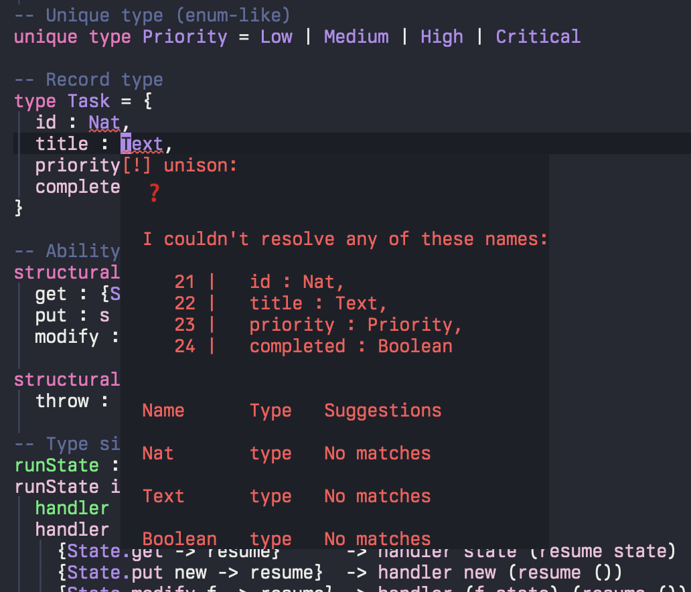

# unison-ts-mode

Emacs major mode for [Unison](https://www.unison-lang.org/) using tree-sitter.

## Screenshots


## Requirements

- Emacs 29+ (with native tree-sitter support)
- [Unison tree-sitter grammar](https://github.com/fmguerreiro/tree-sitter-unison)

## Installation

### Grammar

The tree-sitter grammar will be installed automatically when you first open a `.u` file. You'll see a prompt: "Install Unison grammar for syntax highlighting?"

To control this behavior, customize `unison-ts-grammar-install`:
- `'prompt` (default): Ask before installing
- `'auto`: Install automatically without prompting
- `nil`: Never auto-install

You can also install manually with `M-x unison-ts-install-grammar`.

**Advanced: Custom grammar source**

To use a fork or different branch:

```elisp
(setq unison-ts-grammar-repository "https://github.com/yourname/tree-sitter-unison")
(setq unison-ts-grammar-revision "your-branch")  ; Optional
```

### Package

**use-package + straight:**

```elisp
(use-package unison-ts-mode
  :straight (:host github :repo "fmguerreiro/unison-ts-mode")
  :mode ("\\.u\\'" "\\.unison\\'"))
```

**straight.el:**

```elisp
(straight-use-package
  '(unison-ts-mode :type git :host github :repo "fmguerreiro/unison-ts-mode"))
```

**Doom Emacs:**

```elisp
;; packages.el
(package! unison-ts-mode :recipe (:host github :repo "fmguerreiro/unison-ts-mode"))
```

### Manual Grammar Build

If you prefer to build the grammar manually:

```sh
git clone https://github.com/fmguerreiro/tree-sitter-unison.git
cd tree-sitter-unison

# Determine shared library extension
if [ "$(uname)" = "Darwin" ]; then soext="dylib"
elif uname | grep -q "MINGW"; then soext="dll"
else soext="so"; fi

cd src
cc -fPIC -c -I. parser.c
cc -fPIC -c -I. scanner.c
cc -fPIC -shared *.o -o "libtree-sitter-unison.${soext}"

# Copy to Emacs tree-sitter directory
mkdir -p ~/.emacs.d/tree-sitter
cp "libtree-sitter-unison.${soext}" ~/.emacs.d/tree-sitter/
```

## Features

- Syntax highlighting (4 customizable levels via `treesit-font-lock-level`)
- Indentation
- `treesit-explore-mode` support for syntax tree inspection
- LSP integration (eglot and lsp-mode)

## Font-lock Levels

Customize highlighting depth with `M-x treesit-font-lock-recompute-features` or set `treesit-font-lock-level`:

1. comment, doc, string, declaration, preprocessor, error
2. keyword, type, constant
3. function-call, variable
4. bracket, operator, delimiter

## LSP Support

`unison-ts-mode` includes built-in LSP integration for IDE features like autocomplete, go-to-definition, hover documentation, and diagnostics.



### Prerequisites

- **UCM (Unison Codebase Manager)**: Install from https://www.unison-lang.org/docs/install-instructions/
- UCM will be started automatically in headless mode when you open a `.u` file

### Setup

**Using Eglot (built-in Emacs 29+):**

Eglot will automatically start UCM in headless mode when you open a `.u` file:

```elisp
M-x eglot
```

Or enable automatically:

```elisp
(add-hook 'unison-ts-mode-hook 'eglot-ensure)
```

If you prefer to manage UCM manually, start it before opening files:

```bash
ucm
# or run in background
ucm headless
```

**Using lsp-mode:**

lsp-mode will automatically start UCM in headless mode when you open a `.u` file:

```elisp
M-x lsp
```

Or enable automatically:

```elisp
(add-hook 'unison-ts-mode-hook 'lsp-deferred)
```

If you prefer to manage UCM manually, start it before opening files:

```bash
ucm
# or run in background
ucm headless
```

### Configuration

**Change LSP port:**

Set the `UNISON_LSP_PORT` environment variable:

```bash
export UNISON_LSP_PORT=5758
ucm
```

**Windows users:**

The LSP is disabled by default on Windows. Enable it:

```powershell
[System.Environment]::SetEnvironmentVariable('UNISON_LSP_ENABLED','true')
```

### Troubleshooting LSP

**Connection refused:**
- UCM should auto-start, but if it fails, check if `ucm` is in your PATH: `which ucm`
- Check if port 5757 is listening: `lsof -i :5757` (macOS/Linux) or `netstat -an | findstr 5757` (Windows)
- Try starting UCM manually: `ucm headless`

**No completions/diagnostics:**
- LSP features depend on your current UCM path
- Ensure you're in a valid Unison codebase directory

**Check connection:**
- Eglot: Check `*EGLOT events*` buffer for errors
- lsp-mode: Check `*lsp-log*` buffer and run `M-x lsp-describe-session`

## Troubleshooting

**Installation fails:** The auto-installer requires git and a C compiler. On macOS, install Xcode Command Line Tools:
```sh
xcode-select --install
```

On Linux, install build essentials:
```sh
# Debian/Ubuntu
sudo apt-get install build-essential git

# Fedora/RHEL
sudo dnf install gcc git
```

**ABI version mismatch:** If you encounter ABI compatibility errors, rebuild the grammar with the `--abi=13` flag:

```sh
tree-sitter generate --abi=13
```

**Manual installation:** If auto-install doesn't work, you can install manually following the instructions in the "Manual Grammar Build" section below.

**Grammar not found:** Ensure the compiled grammar is in a directory listed in `treesit-extra-load-path` or the default `~/.emacs.d/tree-sitter/`.

## Contributing

Contributions welcome. Please follow standard GitHub workflow for pull requests.

## License

MIT License. See [LICENSE](LICENSE) for details.

## Credits

Tree-sitter grammar by [@kylegoetz](https://github.com/kylegoetz/tree-sitter-unison).
